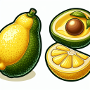
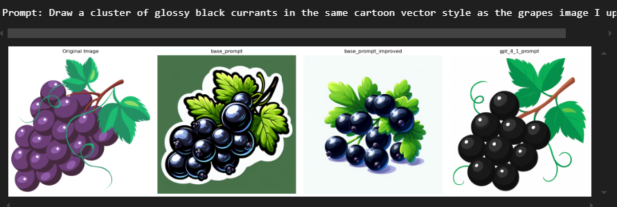
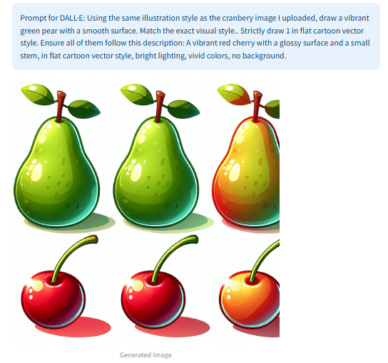
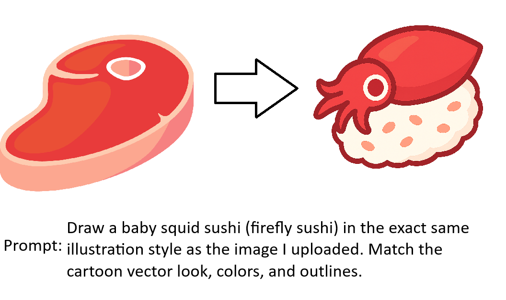
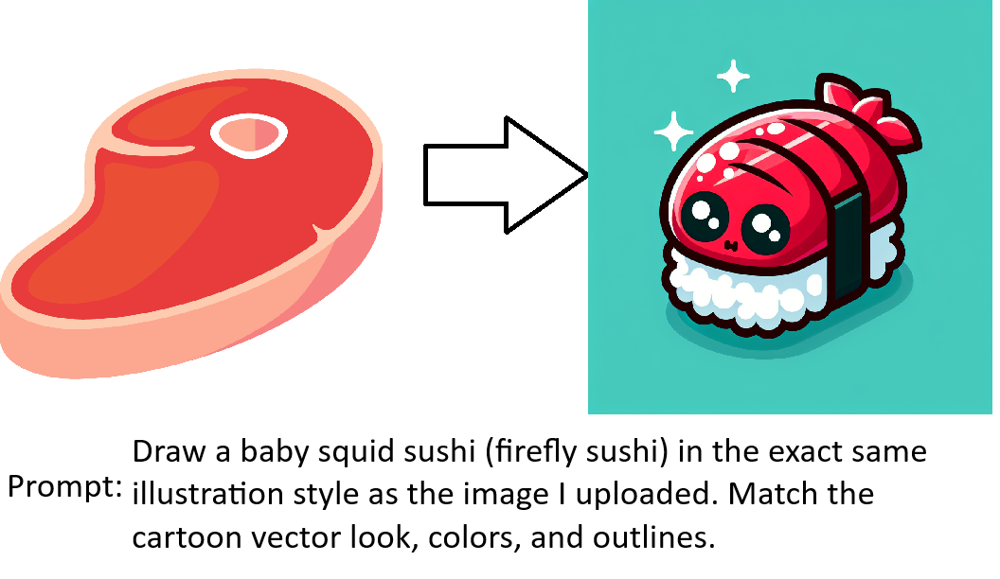

# Food Image Generation and Style Transfer
## Overview


This project provides tools to generate food images.

- Users can upload food images, provide redesign prompts, and receive new generated images.


## Project Structure

- `app/`: Streamlit web application and supporting modules.
  - `app.py`: Main entry point for the Streamlit app.
  - `config.py`: Configuration and API key management.
  - `output_st/`: Stores generated outputs from the Streamlit app.
    - `output_methods/*`: In Streamlit, I save every uploaded and generated image along with its JSON file and prompt for logging purposes.
  - `pages/`: Additional Streamlit pages (e.g., enhanced GPT-4o-mini + DALL·E-3 interface).
- `FluxReduxExperimentation.ipynb`: Flux Redux model and CompfyUI experimentations
- `GPT-4.1.ipynb`: GPT-4.1 usage and experiments
- `GPT-4o-mini_and_DALL·E 3 .ipynb`: GPT-4o-mini_and_DALL·E 3 usage and experiments
- `Showcases_of_generated_images.ipynb`: Plotting and comparison of the outputs from the three methods
- `outputs/`: Stores generated images and JSON results from notebooks
- `comparison_results/`: A file containing the outputs and comparisons of my three methods
- `test_images/`: Example input images for testing.
- `test_inputs.json`: Example prompts and test cases.
- `requirements.txt`: Python dependencies.
 - `config.py`: Configuration and API key management.


## How to Run

1. **Create environment:**
    ```bash
    python -m venv venv 
    venv\Scripts\activate
    ```

2. **Install dependencies:**
    ```bash
    pip install -r requirements.txt
    jupyter notebook # for notebooks
    ```

3. **Set your OpenAI API key**
- Add your API key **config.py** as *OPENAI_API_KEY*.


4. Run the Streamlit app:
  ```
   streamlit run app/app.py
  ```


In the streamlit app,
- You can upload an image
- You can write a prompt to generate a new image
You can test the models and generate your own images. It is saving your requests in `app\output_st` file. 


Use the notebooks for experiments:

See FluxReduxExperimentation.ipynb, Showcases_of_generated_images.ipynb, GPT-4.1.ipynb and GPT-4o-mini_and_DALL·E 3 .ipynb for image generation


## Solution Design & Methodology

In the project, efforts were made to generate new images based on the style of a user-provided image and the content of a desired prompt.

**1. Method: Fine-tuning Stable Diffusion / LoRA / SDXL**

This method is similar to classical machine learning training approaches. When a pre-trained model is further trained on your own dataset, the model, having seen many examples, learns the characteristics of the new dataset. LoRA and SDXL can be used to generate images that match the prompt.
However, image generation models are quite large and require high-capacity GPUs and RAM for training. Training times can be long. I experimented with LoRA fine-tuning on Google Colab Pro using an A100 GPU (40 GB VRAM).
Running these models on the free Colab version is generally not feasible. If you have the time and a powerful machine, it can be attempted, but the consistency and success of the results are not guaranteed, and this method usually causes high costs.

**2. Method: Flux Redux model and ComfyUI**


The Flux Redux model accepts both an image and a prompt when generating new images.

The image is intended to provide the style, while the prompt is meant to guide the content of the new image.

However, it seems that the model mostly ignores the prompt and instead generates variations of the provided image. In practice, it uses the image heavily but doesn't meaningfully incorporate the prompt into the output.

This appears to be due to limitations in the currently available version — full prompt-based guidance alongside image input is only supported via the API or Pro version: https://github.com/black-forest-labs/flux/blob/main/docs/image-variation.md

While researching how to experiment with this model, I came across the **ComfyUI** library. It seems that the ComfyUI pipeline provides a workaround for the above-mentioned limitation.

The same model is also available within the **ComfyUI tool**. It successfully captures the style of the given image and can generate a new image without needing any explicit style details in the prompt. For detailed information and my experiments with this method, you can refer to the `FluxReduxExperimentation.ipynb`
 file.


**3. Method: Multimodal Approach - LLMs/ GPT**


Traditional LLMs work only with text data. However, multimodal LLMs can accept different types of input and also produce various types of output. In our case, both text and image data are involved. Therefore, models that support multimodal inputs—whether paid or open-source—can be considered.

Among the paid models, I conducted tests using the GPT API.

**1. Method: GPT-4o Mini + DALL·E 3 Combined Pipeline**


GPT-4o-mini is one of OpenAI’s models that supports both image and text input. It is quite affordable in terms of pricing. With this model, you can provide an image along with a prompt, ask questions about the image, or guide the model to generate new content based on the image.

DALL·E-3 is a model that generates images from prompts. The prompts it takes are typically similar to image captions.

In my first approach, I combined these two models to form a pipeline. First, I sent the user-provided image and prompt to **GPT-4o-mini** and asked it to generate a caption describing the image.

Then, I combined this generated `caption` with the original `user prompt` and sent it to the DALL·E 3 model.

```bash
full_prompt = f"{user_prompt}, draw in the same illustration style as described:{caption}"
````


 This way, I was able to generate new images that preserved the style of the user’s image while aligning with the prompt content.

You can see the pipeline below: 


- For detailed information and my experiments with this method, you can refer to the `GPT-4o-mini_and_DALL·E 3 .ipynb` file.

- For the generated images, you can refer to the `outputs\base_prompt` file.

- For the streamlit app, you can refer to the `app\pages\GPT-4o-mini_and_DALL-E-3.py` file.


**2. Method: GPT-4o Mini + DALL·E 3 Combined Pipeline Enhanced Version**

In the first method, there was a style mismatch between the uploaded image and the generated one. For example, even if the uploaded image was in a cartoon style, the model could still generate a very realistic image. Additionally, in this method, I had the LLM predict the category of the object and use it in the image generation prompt, but I didn't observe any significant improvement in performance.

In fact, the model misclassified the category in some cases. This led to incorrect captions—for example, if the image contained black currant, GPT-4o Mini sometimes labeled it as cherry, which caused DALL·E to generate an image of a cherry instead.

To overcome these problems, I modified the prompt. I extracted background, quantity, and style information from the given image and included them in the prompt sent to DALL·E. This approach significantly improved the style consistency between the uploaded and generated images. The visual style in the output became much more aligned with the input image.

I also removed the category prediction by the LLM in this method, as relying on the model’s guess wasn’t a reliable approach. Still, the model occasionally generated a wrong category. To address this, I added guidance like the following in the prompt:

```
Important:
Always prioritize the user's input when generating the caption. If the user mentions a category, style, quantity, or any specific detail, you must strictly follow the user's input. User instructions take precedence over visual content.
```

However, this didn’t solve the issue completely. The most effective solution was to have the user write the prompt in a clear, step-by-step manner using short sentences.

For example:

❌ This prompt confuses the LLM:
```
Using the same illustration style as the orange slice image I uploaded, draw a vibrant green sliced avocado with a smooth surface. Match the exact visual style.
```

✅ This prompt reduces confusion and gives clearer instructions:
```
This is a black currant. Draw me a green pear. Use the same image drawing style in the image.`
```

The second method produced images with styles that were more consistent with the input. Also, writing clear, step-by-step prompts was helpful in both methods.


- For detailed information and my experiments with this method, you can refer to the `GPT-4o-mini_and_DALL·E 3 .ipynb` file.

- For the generated images, you can refer to the `outputs\base_prompt_improved` file.

- For the streamlit app, you can refer to the `app\pages\GPT-4o-mini_and_DALL-E-3_enhanced.py` file.


**3. Method: GPT-4.1-mini Pipeline**

OpenAI's model that can take both an image and text as input and generate an image accordingly is more expensive compared to the other method. It receives the user's prompt and image, then generates a new image that aligns with the prompt. This approach is significantly more successful than the previous two methods. It produced accurate results in terms of style consistency, prompt alignment, and the number of objects depicted in the generated image.


- For detailed information and my experiments with this method, you can refer to the `GPT-4.1.ipynb` file.

- For the generated images, you can refer to the `outputs\gpt_4_1_prompt` file.

- For the streamlit app, you can refer to the `app\pages\GPT-4-1-mini.py` file.


## Showcase of Generated Examples

There are some bunch of examples of images. The first is original image, 2nd combined method, 3rd en hanced combined method and 4rd GPT-4.1-mini model's output.


Sometimes combined methods are generating wrong images.

**Wrong Image:**
It is generated by first method:



Continues to show images: 





- In the sample below, the combined methods had difficulty understanding the original images. Because it thought cranberry image was cherry, it produced captions with “cherry,” which caused DALL·E to generate cherry images as well.

   Wrong Image:
   

When I explained things clearly and step-by-step like this, the model was able to generate the pear it was supposed to.


It  was the same for black currant image.


- One of the most commonly mistaken and confused prompts was this. I would send a **banana** image and ask for an **apricot**. You can see the results in the picture below.

Wrong Image:


I think the reason for the confusion is that the input and output images are very unrelated. When sending an apple image and asking to regenerate it as a round-shaped tomato or changing its color and asking to produce the apple again, the model shows higher accuracy. However, it struggled to generate images that are very unrelated like this.


**The incredible success of GPT-4.1:**

I gave GPT-4.1-mini an image of a pear and asked it to draw a completely nonexistent purple banana while keeping the style.


To make it more challenging, I tried the same example with my enhance method (method 2) and GPT-4.1-mini.

I gave it a picture of a **steak** and asked it to draw **baby squid sushi** while keeping the style.


GPT4.1-mini result: 


 GPT-4o Mini + DALL·E-3 result : 


In terms of details, background, and image style, GPT-4.1-mini performed very well in all aspects.


- For detailed information and all plots, you can refer to the `Showcases_of_generated_images.ipynb` file.

- For comparison plots, you can refer to the `comparison_results` file.


## Self-Critique, Challenges, and Future Improvement Ideas


First, I tried fine-tuning, but it took too much time and I was facing resource constraints. The models are very large, so fine-tuning them is quite challenging.

Open-source multimodal models could also be tried. They might not perform as well as GPT-4.1-mini, but could be more cost-effective.

The combined method I suggested can be improved. The prompts can be refined.

Other paid models can be tested as well.

CompfyUI is a free tool and can be explored if it can serve the purpose.


**My General Findings**

- I believe GPT-4.1-mini was the most successful method in all the experiments I tried. It produced outputs that preserved the style according to the prompt.

- I observed that giving too many details in the prompt tends to confuse the model's output even more.

- The more the input image and the expected output image resemble each other in visual design, the better results are achieved.

- The instructions written inside the prompt do not guide the GPT-4o-mini model enough to avoid mistakes. To prevent this, the prompt needs to be clear and explained step-by-step.

- In the combined method, giving any additional style information to DALL·E affects style preservation.

- If the input image contains more than one object, the combined methods struggle to produce successful results for all of them.

- Since we generate the caption in the combined methods, if the object in the image cannot be easily recognized by GPT-4o-mini, it negatively impacts DALL·E’s output.


